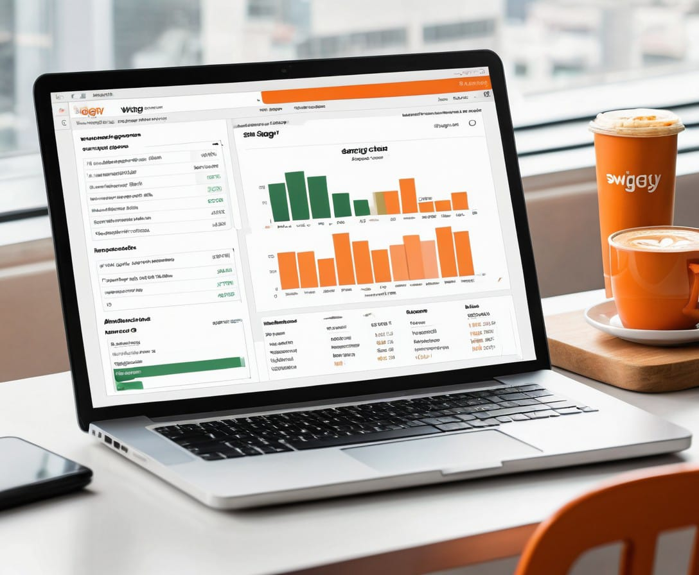

# Swiggy SQL Case Study

## Overview

This repository contains an end-to-end SQL case study focused on Swiggy, a popular food delivery platform. The objective of this case study was to clean and analyze Swiggy's data to derive meaningful insights and trends. This README file provides an overview of the project, including the steps taken for data cleaning and the insights obtained from the analysis.

## Table of Contents

- [Introduction](#introduction)
- [Data Cleaning](#data-cleaning)
- [Analysis](#analysis)
- [Results](#results)
- [Conclusion](#conclusion)
- [Repository Structure](#repository-structure)
- [How to Use](#how-to-use)
- [License](#license)

## Introduction

Swiggy, being one of the largest food delivery platforms, generates a vast amount of data daily. This case study aims to demonstrate the process of cleaning and analyzing this data using SQL. The goal is to ensure data quality and extract actionable insights that can be used for strategic decision-making.

## Data Cleaning

Data cleaning is a critical step in any data analysis project. The Swiggy dataset contained various inconsistencies and errors that needed to be addressed. The steps taken for data cleaning included:

- **Removing Duplicate Records:** Identifying and deleting duplicate rows to ensure data accuracy.
- **Handling Missing Values:** Replacing or imputing missing values to maintain data integrity.
- **Standardizing Formats:** Ensuring consistency in data formats for fields like dates, phone numbers, and addresses.
- **Correcting Errors:** Identifying and correcting incorrect data entries.
- **Normalization:** Organizing data to reduce redundancy and improve database efficiency.

## Conclusion

The case study demonstrates the importance of thorough data cleaning and detailed analysis in deriving actionable insights from raw data. These insights can help Swiggy optimize its operations, improve customer satisfaction, and drive business growth.
